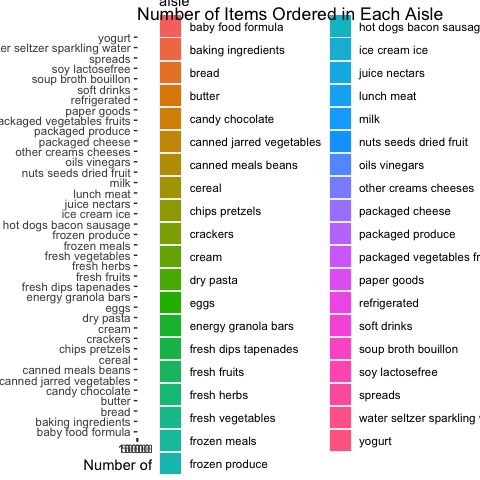
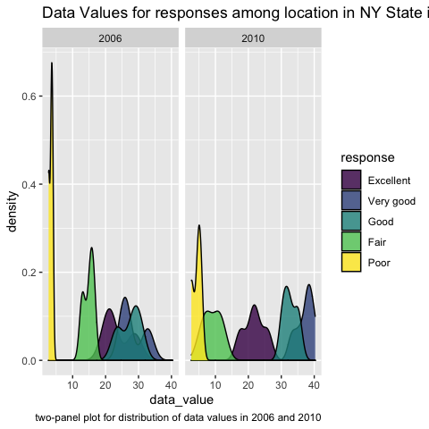
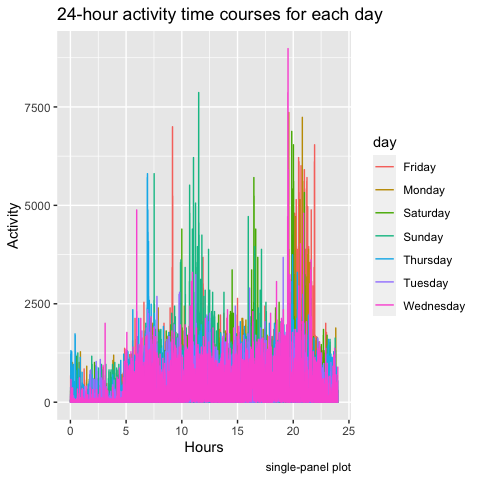

p8105\_hw3\_yl4928
================
Rachel
10/18/2021

``` r
library(tidyverse)
```

## problem 1

``` r
library(p8105.datasets)
data("instacart")

instacart_df = instacart
```

1.0.1 a short description of the dataset, noting the size and structure
of the data, describing some key variables, and giving illstrative
examples of observations.

The instacart dataset containts 1384617 observations. It contains 15
variables. There are
`order_id, product_id, add_to_cart_order, reordered, user_id, eval_set, order_number, order_dow, order_hour_of_day, days_since_prior_order, product_name, aisle_id, department_id, aisle, department`
variables in this dataset. Among those variables, some key variables
include `order_id`, `product_id`, `add_to_cart_order`, `user_id`,
`user_id`, `aisle_id`, `product_name`, and `department_id`.

1.0.2 Giving illstrative examples of observations.

``` r
head(instacart, 6)
```

    ## # A tibble: 6 × 15
    ##   order_id product_id add_to_cart_order reordered user_id eval_set order_number
    ##      <int>      <int>             <int>     <int>   <int> <chr>           <int>
    ## 1        1      49302                 1         1  112108 train               4
    ## 2        1      11109                 2         1  112108 train               4
    ## 3        1      10246                 3         0  112108 train               4
    ## 4        1      49683                 4         0  112108 train               4
    ## 5        1      43633                 5         1  112108 train               4
    ## 6        1      13176                 6         0  112108 train               4
    ## # … with 8 more variables: order_dow <int>, order_hour_of_day <int>,
    ## #   days_since_prior_order <int>, product_name <chr>, aisle_id <int>,
    ## #   department_id <int>, aisle <chr>, department <chr>

1.1 How many aisles are there, and which aisles are the most items
ordered from?

``` r
n_of_aisles = 
  instacart_df %>% 
  count(aisle, name = "n_of_aisles") %>% 
  arrange(desc(n_of_aisles))

n_of_aisles
```

    ## # A tibble: 134 × 2
    ##    aisle                         n_of_aisles
    ##    <chr>                               <int>
    ##  1 fresh vegetables                   150609
    ##  2 fresh fruits                       150473
    ##  3 packaged vegetables fruits          78493
    ##  4 yogurt                              55240
    ##  5 packaged cheese                     41699
    ##  6 water seltzer sparkling water       36617
    ##  7 milk                                32644
    ##  8 chips pretzels                      31269
    ##  9 soy lactosefree                     26240
    ## 10 bread                               23635
    ## # … with 124 more rows

In the `n_of_aisles`, there are 134 aisles. The most items is
`fresh vegetables`.

1.2 Make a plot that shows the number of items ordered in each aisle,
limiting this to aisles with more than 10000 items ordered. Arrange
aisles sensibly, and organize your plot so others can read it.

``` r
n_of_aisles %>% 
  filter(n_of_aisles > 10000) %>% 
  ggplot(aes(x = n_of_aisles, y = aisle, fill = aisle)) + 
  geom_bar(
    stat = "identity", 
  ) + 
  labs(
    title = "Number of Items Ordered in Each Aisle", 
    capition = "Aisles with more than 10000 items ordered", 
    x = "Number of items", 
    y = "Aisle"
  )
```

<!-- -->

1.3 Make a table showing the three most popular items in each of the
aisles “baking ingredients”, “dog food care”, and “packaged vegetables
fruits”. Include the number of times each item is ordered in your table.

``` r
instacart_df %>% 
  filter(aisle == c("baking ingredients", "dog food care", "packaged vegetables fruits")) %>% 
  group_by(aisle, product_name) %>% 
  summarize(n_items_ordered = n()) %>% 
  arrange(desc(n_items_ordered)) %>% 
  do(head(., n = 3)) %>% 
  knitr::kable(
    caption = "Three Most Popular Items"
  )
```

| aisle                      | product\_name                                   | n\_items\_ordered |
|:---------------------------|:------------------------------------------------|------------------:|
| baking ingredients         | Light Brown Sugar                               |               157 |
| baking ingredients         | Pure Baking Soda                                |               140 |
| baking ingredients         | Organic Vanilla Extract                         |               122 |
| dog food care              | Organix Grain Free Chicken & Vegetable Dog Food |                14 |
| dog food care              | Organix Chicken & Brown Rice Recipe             |                13 |
| dog food care              | Original Dry Dog                                |                 9 |
| packaged vegetables fruits | Organic Baby Spinach                            |              3324 |
| packaged vegetables fruits | Organic Raspberries                             |              1920 |
| packaged vegetables fruits | Organic Blueberries                             |              1692 |

Three Most Popular Items

1.4 Make a table showing the mean hour of the day at which Pink Lady
Apples and Coffee Ice Cream are ordered on each day of the week; format
this table for human readers (i.e. produce a 2 x 7 table).

``` r
instacart_df %>% 
  filter(product_name == c("Pink Lady Apples", "Coffee Ice Cream")) %>% 
  group_by(product_name, order_dow) %>% 
  summarize(
    mean_hour_of_day = mean(order_hour_of_day)) %>% 
  mutate(order_dow = recode(order_dow, 
                            "0" = "Monday", 
                            "1" = "Tuesday",
                            "2" = "Wednesday", 
                            "3" = "Thursday", 
                            "4" = "Friday", 
                            "5" = "Saturday", 
                            "6" = "Sunday")) %>% 
  pivot_wider(
    names_from = order_dow,
    values_from = mean_hour_of_day
  ) %>% 
  knitr::kable(
    digits = 2,
    caption = "Mean Hour of the Day")
```

    ## Warning in product_name == c("Pink Lady Apples", "Coffee Ice Cream"): longer
    ## object length is not a multiple of shorter object length

| product\_name    | Monday | Tuesday | Wednesday | Thursday | Friday | Saturday | Sunday |
|:-----------------|-------:|--------:|----------:|---------:|-------:|---------:|-------:|
| Coffee Ice Cream |  13.22 |   15.00 |     15.33 |    15.40 |  15.17 |    10.33 |  12.35 |
| Pink Lady Apples |  12.25 |   11.68 |     12.00 |    13.94 |  11.91 |    13.87 |  11.56 |

Mean Hour of the Day

## Problem 2

2.0 load the dataset of `BRFSS`.

``` r
data("brfss_smart2010")
brfss_df = brfss_smart2010
```

2.1 do some data cleaning: format the data to use appropriate variable
names; focus on the “Overall Health” topic; include only responses from
“Excellent” to “Poor”; organize responses as a factor taking levels
ordered from “Poor” to “Excellent”.

``` r
brfss_df = 
  brfss_df %>% 
  janitor::clean_names() %>% 
  filter(topic == "Overall Health") %>% 
  mutate(
    response = factor(response, 
                     levels = c("Excellent", "Very good", "Good", "Fair", "Poor"),
                     ordered = TRUE)
  )

brfss_df
```

    ## # A tibble: 10,625 × 23
    ##     year locationabbr locationdesc  class  topic  question  response sample_size
    ##    <int> <chr>        <chr>         <chr>  <chr>  <chr>     <ord>          <int>
    ##  1  2010 AL           AL - Jeffers… Healt… Overa… How is y… Excelle…          94
    ##  2  2010 AL           AL - Jeffers… Healt… Overa… How is y… Very go…         148
    ##  3  2010 AL           AL - Jeffers… Healt… Overa… How is y… Good             208
    ##  4  2010 AL           AL - Jeffers… Healt… Overa… How is y… Fair             107
    ##  5  2010 AL           AL - Jeffers… Healt… Overa… How is y… Poor              45
    ##  6  2010 AL           AL - Mobile … Healt… Overa… How is y… Excelle…          91
    ##  7  2010 AL           AL - Mobile … Healt… Overa… How is y… Very go…         177
    ##  8  2010 AL           AL - Mobile … Healt… Overa… How is y… Good             224
    ##  9  2010 AL           AL - Mobile … Healt… Overa… How is y… Fair             120
    ## 10  2010 AL           AL - Mobile … Healt… Overa… How is y… Poor              66
    ## # … with 10,615 more rows, and 15 more variables: data_value <dbl>,
    ## #   confidence_limit_low <dbl>, confidence_limit_high <dbl>,
    ## #   display_order <int>, data_value_unit <chr>, data_value_type <chr>,
    ## #   data_value_footnote_symbol <chr>, data_value_footnote <chr>,
    ## #   data_source <chr>, class_id <chr>, topic_id <chr>, location_id <chr>,
    ## #   question_id <chr>, respid <chr>, geo_location <chr>

2.2.1 In 2002, which states were observed at 7 or more locations? What
about in 2010?

``` r
year_2002 = 
  brfss_df %>% 
  filter(year == 2002) %>% 
  group_by(locationabbr) %>% 
  summarize(number_locations = n()/5) %>% 
  filter(number_locations >= 7) %>% 
  arrange(number_locations) 

year_2002 %>% 
  knitr::kable(
    caption = "Number of Locations were observed in 2002" 
  )
```

| locationabbr | number\_locations |
|:-------------|------------------:|
| CT           |                 7 |
| FL           |                 7 |
| NC           |                 7 |
| MA           |                 8 |
| NJ           |                 8 |
| PA           |                10 |

Number of Locations were observed in 2002

In 2002, there are 6 states were observed at 7 or more locations, which
are CT, FL, NC, MA, NJ, PA.

``` r
year_2010 = 
  brfss_df %>% 
  filter(year == 2010) %>% 
  group_by(locationabbr) %>% 
  summarize(number_locations = n()/5) %>% 
  filter(number_locations >= 7) %>% 
  arrange(number_locations) 

year_2010 %>% 
  knitr::kable(
    caption = "Number of Locations were observed in 2010" 
  )
```

| locationabbr | number\_locations |
|:-------------|------------------:|
| CO           |                 7 |
| PA           |                 7 |
| SC           |                 7 |
| OH           |                 8 |
| MA           |                 9 |
| NY           |                 9 |
| NE           |                10 |
| WA           |                10 |
| CA           |                12 |
| MD           |                12 |
| NC           |                12 |
| TX           |                16 |
| NJ           |                19 |
| FL           |                41 |

Number of Locations were observed in 2010

In 2010, there are 14 states were observed at 7 or more locations, which
are CO, PA, SC, OH, MA, NY, NE, WA, CA, MD, NC, TX, NJ, FL.

2.2.2 Construct a dataset that is limited to Excellent responses, and
contains, year, state, and a variable that averages the data\_value
across locations within a state. Make a “spaghetti” plot of this average
value over time within a state (that is, make a plot showing a line for
each state across years – the geom\_line geometry and group aesthetic
will help).

``` r
excellent_response = 
  brfss_df %>% 
  filter(response == "Excellent") %>% 
  group_by(year, locationabbr) %>% 
  summarize(
    mean_data_value = mean(data_value, na.rm = TRUE),
  ) %>% 
  ggplot(aes(x = year, y = mean_data_value, color = locationabbr)) + 
  geom_line(size = .9) +
  theme(
    legend.position = "right"
  ) +
  labs(
    title = "Mean of teh data_value Across Locatiosn Within a State",
    caption = "limited to Excellent responses"
  )
```

2.2.3 Make a two-panel plot showing, for the years 2006, and 2010,
distribution of data\_value for responses (“Poor” to “Excellent”) among
locations in NY State.

``` r
brfss_df %>% 
  filter(year == c(2006, 2010) & locationabbr == "NY") %>% 
  ggplot(aes(x = data_value, fill = response)) + 
  geom_density(alpha = .8) +
  facet_grid(.~ year) +
  labs(
    title = "Data Values for responses among location in NY State in 2006 and 2010", 
    caption = "two-panel plot for distribution of data values in 2006 and 2010"
  )
```

    ## Warning in year == c(2006, 2010): longer object length is not a multiple of
    ## shorter object length

<!-- -->

## Problem 3

3.1 Load, tidy, and otherwise wrangle the data

``` r
accel_df = read_csv("./data/accel_data.csv") %>% 
  janitor::clean_names() %>% 
  pivot_longer(
    activity_1:activity_1440, 
    names_prefix = "activity_", 
    names_to = "minute", 
    values_to = "activity"
    ) %>% 
  mutate(
    minute = as.numeric(minute), 
    day_of_week = recode(day,"Monday" = "Weekday", 
                         "Tuesday" = "Weekday", 
                         "Wednesday" = "Weekday", 
                         "Thursday" = "Weekday", 
                         "Friday" = "Weekday", 
                         "Saturday" = "Weekend", 
                         "Sunday" = "Weekend") 
  )
```

3.1.1 Describe the resulting dataset In this dataset, there are 6
varaibles, which are week, day\_id, day, minute, activity, day\_of\_week
variables. There are 50400 observations.

3.2 aggregate accross minutes to create a total activity variable for
each day, and create a table showing these totals. Are any trends
apparent?

``` r
totalact_df = 
  accel_df %>% 
  group_by(week, day) %>% 
  summarize(sum_of_activity = sum(activity)) %>% 
  knitr::kable(
    catpion = "Total activity variable for each day"
  )
```

    ## `summarise()` has grouped output by 'week'. You can override using the `.groups` argument.

Obviously, the total activity during weekdays is much more than the
weekends.

3.3 Make a single-panel plot that shows the 24-hour activity time
courses for each day and use color to indicate day of the week.

``` r
accel_df %>% 
  ggplot(aes(x = minute/60, y = activity, color = day)) +
  geom_line() + 
  labs(
    x = "Hours", 
    y = "Activity", 
    title = "24-hour activity time courses for each day",
    caption = "single-panel plot"
  )
```

<!-- -->
Based on this single-panel plot, it is obvious that during a 24-hour
activity time course, the total activity is more within a day from hour
6 to hour 22 approximately than other hours within a day.
